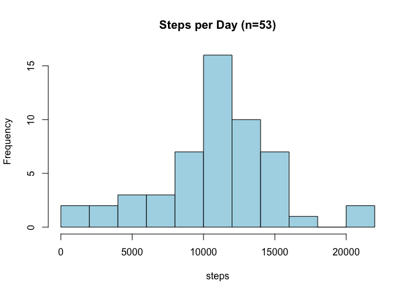

## Load/attach add-on packages for later use


```r
library(dplyr)
```

```
## 
## Attaching package: 'dplyr'
```

```
## The following objects are masked from 'package:stats':
## 
##     filter, lag
```

```
## The following objects are masked from 'package:base':
## 
##     intersect, setdiff, setequal, union
```

```r
library(lubridate)
```

```
## 
## Attaching package: 'lubridate'
```

```
## The following objects are masked from 'package:base':
## 
##     date, intersect, setdiff, union
```

```r
library(ggplot2)
```

## Loading and preprocessing the data
The code directly below reads in the project csv from directory; coerces the variable "date" to class "POSIXct"/"POSIXlt"; and coerces the variable "interval" to class "Period"

```r
activity <- read.csv("activity.csv")
activity[, 2] <- ymd(activity[, 2], tz = "America/Los_Angeles")
activity[, 3] <- hms(format(strptime(sprintf("%04d", activity[, 3]), format = "%H%M"), "%H:%M:%S"))
```

## What is mean total number of steps taken per day?
This code first calculates the total number of steps taken per day (NAs are omitted); makes a histogram of the total number of steps taken per day; and calculates then reports, the mean and median of the total number of steps taken per day. 

```r
StepsPerDay <- activity %>% na.omit() %>% group_by(date) %>% summarise(steps = sum(steps), .groups = "drop") %>% data.frame()
with(StepsPerDay, hist(steps, breaks = 9, col = "lightblue", main = "Steps per Day (n=53)"))
```

<!-- -->

```r
meanSteps <- mean(StepsPerDay$steps)
medianSteps <- median(StepsPerDay$steps)
print(meanSteps)
```

```
## [1] 10766.19
```

```r
print(medianSteps)
```

```
## [1] 10765
```

## What is the average daily activity pattern?
This code calculates the average number of steps taken per 5-min interval, averaged across all days (NAs are omitted); makes a time series plot of the average number of steps taken per 5-min interval; and then locates and returns the 5-min interval that, on average, contains the maximum number of steps

```r
AvgSteps <- group_by(activity, interval) %>% na.omit() %>% summarise(meanSteps = mean(steps), .groups = "drop") %>%  data.frame()
g <- ggplot(AvgSteps, aes(interval, meanSteps)) + labs(title = "Avg.Steps Taken per 5-min (days=53)") + 
        ylab("Steps") + xlab("Time series") + theme(axis.title = element_text(size = 8), title = element_text(size = 9))
g + scale_x_time() + geom_line(color = "steelblue4")
```

<!-- -->

```r
slice_max(AvgSteps, order_by = meanSteps)
```

```
##    interval meanSteps
## 1 8H 35M 0S  206.1698
```

## Imputing missing values
This code calculates and reports the total number of missing values in the data set by obtaining a summary() of the "steps" variable of the original data set (NAs are on the right) since no errors occurred while preprocessing the other two variables; then the code will impute the missing values with steps-per-interval means, calculated across all other days with real values corresponding to that interval


```r
summary(activity$steps)
```

```
##    Min. 1st Qu.  Median    Mean 3rd Qu.    Max.    NA's 
##    0.00    0.00    0.00   37.38   12.00  806.00    2304
```

```r
activity_impute <- activity %>% group_by(interval) %>% mutate(steps = ifelse(is.na(steps), mean(steps, na.rm = TRUE), steps)) %>% ungroup() %>% data.frame()
```
This code calculates the total number of steps taken per day using the new data set; then uses the results to make a histogram of the total number of steps taken each day; then calculates and reports the differences in the mean and median values (of the total number of step taken per day) of the new data set compared to the original

```r
DailyStepCount <- activity_impute %>% group_by(date) %>% summarise(steps = sum(steps), .groups = "drop") %>% data.frame()
with(DailyStepCount, hist(steps, breaks = 9, col = "lightblue", main = "Steps per Day (days=61)"))
```

<!-- -->

```r
meanStepsI <- mean(DailyStepCount$steps)
medianStepsI <- median(DailyStepCount$steps)
print(meanStepsI)
```

```
## [1] 10766.19
```

```r
print(medianStepsI)
```

```
## [1] 10766.19
```

```r
MeansDif = meanStepsI - meanSteps
print(MeansDif)
```

```
## [1] 0
```

```r
MediansDif = medianStepsI - medianSteps
print(MediansDif)
```

```
## [1] 1.188679
```

## Are there differences in activity patterns between weekdays and weekends?
This code creates a new factor variable with two levels, "weekday" and "weekend", indicating whether the given day is a weekend or weekday day; then calculates the average number of steps taken for each interval, averaged across all weekday days and weekend days; then makes a panel plot containing a time series plot of the 5-min interval and average steps taken

```r
activity_day <- activity_impute %>% mutate(dayGroup = ifelse(weekdays(date) %in% c("Monday", "Tuesday", "Wednesday", "Thursday", "Friday"), "weekday", "weekend")) %>% 
        mutate(dayGroup = as.factor(dayGroup)) %>% group_by(dayGroup, interval) %>% summarise(meanSteps = mean(steps), .groups = "drop") %>% data.frame()
g <- ggplot(activity_day, aes(interval, meanSteps)) + labs(title = "Avg.Steps per 5-min") + 
        ylab("Steps") + xlab("Time series") + theme(axis.title = element_text(size = 8), title = element_text(size = 9)) + geom_line(color = "steelblue")
g + scale_x_time() + facet_wrap(. ~ dayGroup, nrow = 2, ncol = 1, strip.position = "top")
```

<!-- -->


